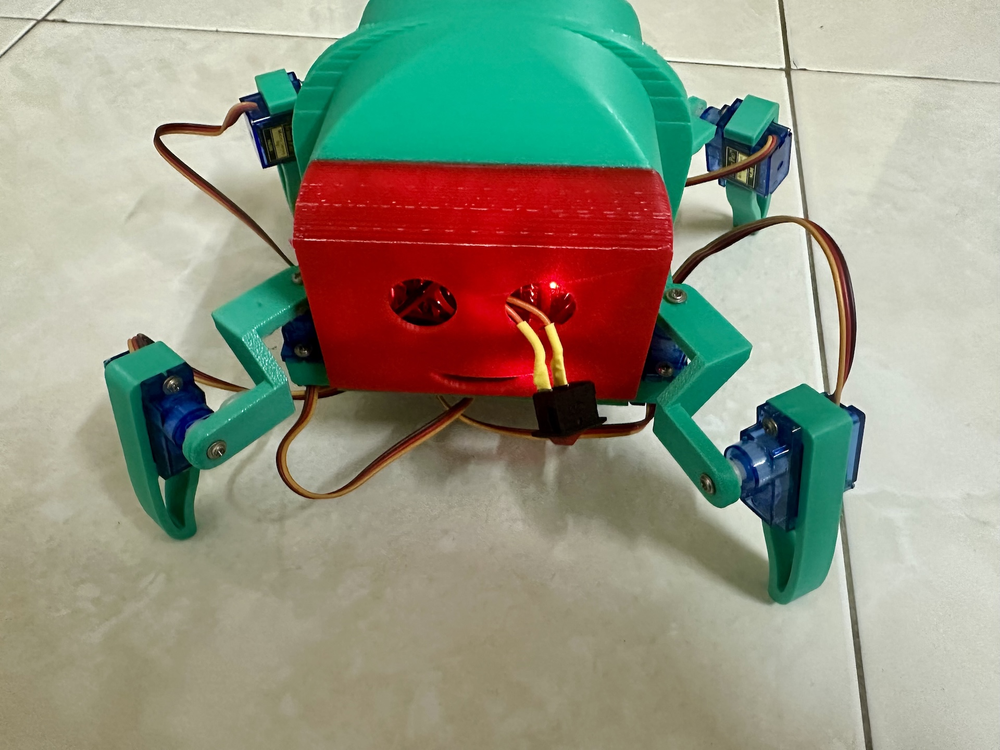

# Arduino Quadruped Spider Robot


A four-legged spider robot powered by an Arduino Nano. This project utilizes a PCA9685 servo driver to control 8 servo motors, enabling a variety of movements that can be controlled via Bluetooth using a smartphone.

## Demo

Here are some images and GIFs of the spider robot in action:

**Example:**



*Caption: The spider robot in its default idle position.*

**Example GIF:**


*Caption: The spider is happy.*

## Features

* **Bluetooth Control:** Wirelessly control the robot using the Dabble app on a smartphone.
* **Dynamic Movements:** Capable of walking forward and turning left or right.
* **Special Actions:** Pre-programmed actions like a "happy dance," "defense mode," and a "pull-up" motion.
* **Scalable Design:** The PCA9685 driver supports up to 16 channels, leaving room for future expansion.

## Hardware Components

| Component | Quantity | Purpose |
| :--- | :---: | :--- |
| **Arduino Nano** | 1 | Main microcontroller for processing commands. |
| **PCA9685 Servo Driver** | 1 | Manages PWM signals for all 8 servo motors. |
| **JDY-33 Bluetooth Module** | 1 | Enables wireless communication (SPP & BLE). |
| **Servo Motors** | 8 | Actuators for hip and knee joints. |
| **liPo Battery** | 2 | 3.7V LiPo Battery. |
| **3D Printed** | 1 | 3D printed for the spider. |

## Wiring Diagram

### Controller and Bluetooth

| JDY-33 Pin | Connects to |
| :--- | :--- |
| `TX` | Arduino Nano `D4` |
| `RX` | Arduino Nano `D5` |
| `VCC` | `3.3V` or `5V` |
| `GND` | `GND` |

### Servo Driver

| PCA9685 Pin | Connects to |
| :--- | :--- |
| `VCC` | Arduino Nano `5V` |
| `GND` | `GND` |
| `SDA` | Arduino Nano `A4` |
| `SCL` | Arduino Nano `A5` |
| `V+` | External 5V Power Supply |

### Servo Motor Connections (to PCA9685)

| Channel | Joint | Channel | Joint |
| :--- | :--- | :--- | :--- |
| **0** | Front Left Hip | **4** | Back Left Hip |
| **1** | Front Left Knee | **5** | Back Left Knee |
| **2** | Front Right Hip | **6** | Back Right Hip |
| **3** | Front Right Knee | **7** | Back Right Knee |

## Software and Dependencies

This project relies on the Arduino IDE and several libraries.

1. **Arduino IDE:** [Download here](https://www.arduino.cc/en/software)
2. **Required Libraries:**
    * `Wire` (Built-in)
    * `SoftwareSerial` (Built-in)
    * [Adafruit PWM Servo Driver Library](https://github.com/adafruit/Adafruit-PWM-Servo-Driver-Library)
    * [Dabble Library](https://thestempedia.com/docs/dabble/arduino-ide-installation/)

## Setup and Installation

1. **Assemble Hardware:** Connect all components as shown in the wiring diagram. Ensure the external power supply for the servos is correctly connected.
2. **Install Libraries:** Open the Arduino IDE and install the required libraries via the Library Manager.
3. **Upload Code:** Flash the main control code to your Arduino Nano.

    ```bash
    spider-robot/main/main.ino
    ```

4. **Install Dabble App:** Install the [Dabble](https://thestempedia.com/product/dabble) application on your smartphone.
5. **Pair Bluetooth:** Power on the robot and pair your smartphone with the `JDY-33` Bluetooth module.
6. **Connect in App:** Open the Dabble app, connect to the robot, and select the Gamepad module.

## How to Use

1. **Power On:** Turn on the robot. It will assume its default idle position.
2. **Connect:** Launch the Dabble app and establish a connection with the robot.
3. **Control:** Use the gamepad interface to control the robot's movements and actions.

### Control Scheme

| Dabble Input | Robot Action | Function Called |
| :--- | :--- | :--- |
| **Up Arrow** | Move Forward | `moveForward()` |
| **Left Arrow** | Turn Left | `turnLeft()` |
| **Right Arrow** | Turn Right | `turnRight()` |
| **Triangle** | Happy Dance | `happyAction()` |
| **Cross** | Defense Mode | `defenseAction()` |
| **Circle** | Pull-up | `pullUpAction()` |
| *(No Input)* | Idle Position | `idle()` |

## Calibration and Debugging

If the robot's movements are erratic, you may need to calibrate the servos.

1. **Upload Debug Sketch:** Flash the `debug/debug.ino` file to the Arduino Nano.
2. **Open Serial Monitor:** Set the baud rate to `9600`.
3. **Send Commands:** Test each servo individually by sending commands in the format `<servo_number> <angle>`.
    * Example: `1 90` sets servo 1 to a 90-degree angle.
    * Use command `8` to reset all servos to the idle position (45°).

### Servo Mappings for Debugging

| Servo Number | Joint Assignment |
| :---: | :--- |
| `0` | FRONT_LEFT_HIP |
| `1` | FRONT_LEFT_KNEE |
| `2` | FRONT_RIGHT_HIP |
| `3` | FRONT_RIGHT_KNEE |
| `4` | BACK_LEFT_HIP |
| `5` | BACK_LEFT_KNEE |
| `6` | BACK_RIGHT_HIP |
| `7` | BACK_RIGHT_KNEE |

## Contributing

Contributions are welcome! If you have ideas for improvements or have found a bug, please feel free to:

1. Fork the repository.
2. Create a new branch (`git checkout -b feature/your-feature-name`).
3. Commit your changes (`git commit -m 'Add some feature'`).
4. Push to the branch (`git push origin feature/your-feature-name`).
5. Open a Pull Request.

Alternatively, you can open an issue with the "bug" or "enhancement" tag.

## License

This project is open-source. See the [LICENSE](./LICENSE) file for more details.

## Acknowledgments

* A big thank you to the creators of the libraries used in this project.
* Inspiration from the broader Arduino and robotics communities.

## Contributors

* [Tai Ngo](https://github.com/TaiVanNgo): Software Lead
* [Vinh Pham](https://github.com/petervinhpnp): Hardware Lead

## Contact

If you have questions or would like to connect:

* Email: [vantaingo.056@gmail.com](mailto:vantaingo.056@gmail.com)  
* LinkedIn: [Tai Ngo](https://www.linkedin.com/in/taivanngo)  
* GitHub: [TaiVanNgo](https://github.com/TaiVanNgo)
* Youtube: [taivan130](https://www.youtube.com/@taivan130)
